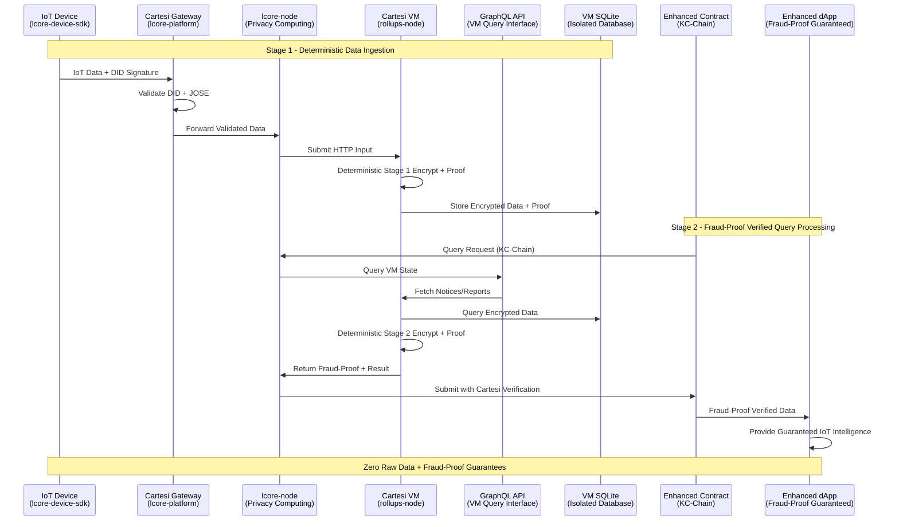

# KC-Chain Enhanced Stress Test Simulator with IoT Data Pipeline

> **📋 STRESS TEST DOCUMENTATION**: This repository contains stress testing tools to validate basic implementations and assumptions of the IoT-L{CORE} ecosystem across multiple repositories.

This repository contains an enhanced load-testing framework for KC-Chain (Arbitrum Orbit) devnet that integrates real IoT data simulation through the validated lcore-node MVP architecture. It dispatches realistic, randomly-generated transactions across both traditional blockchain operations and real IoT data pipeline workflows.

---

## Adjustments to the Original Proposal

We dropped the fully-homomorphic-encryption track because ciphertexts and evaluation keys were 50-100× larger than our dual-encryption payloads and each FHE evaluation would have pushed the Cartesi VM beyond its block-time budget, inflating gas costs; the AES-256-GCM + XChaCha20-Poly1305 pipeline paired with lightweight zk-proofs gives the same privacy and verifiability guarantees while fitting within snapshot size and fee constraints.

Architecturally, the project is now anchored on a KC-Chain Orbit chain (L2) that serves as the shared execution layer; each smart-city zone spins up its own L3 “city-chain” rollup running the multi-dApp Cartesi stack, and all of those L3s settle and inherit security from the Orbit L2 while sharing the same Stylus contract framework and dispute-resolution system.

---

## 🚀 Enhanced Features

### Traditional Blockchain Stress Testing
1. `payment_app` – user payments in local currency (simulated as ETH transfers)
2. `merchant_app` – business settlements
3. `lending_app` – loan origination / repayments

### **NEW: Real IoT Data Pipeline Integration**
4. `data_pipeline` – **Real IoT device simulation with dual-encryption pipeline**
   - **Device Registration**: Simulates IoT devices registering through lcore-node MVP
   - **Real Data Submission**: Uses actual CSV data samples (EV, greenhouse, sales)
   - **Dual Encryption**: AES-256-GCM + ChaCha20-Poly1305 pipeline
   - **On-Chain Commitment**: Direct integration with deployed [MVPIoTProcessor](https://github.com/Modern-Society-Labs/lcore-platform) Stylus contract

### Deployment Targets
This project is designed to run **24/7** on [Railway](https://railway.app/) while still being effortless to clone and run locally.

* **Live Demo** – the public Railway URL exposes:
  * `/health` → simple 200 OK liveness probe
  * `/metrics` → JSON snapshot of KPIs (volume, latency, success-rate)
* **Self-host** – clone, `cp env.example .env`, then either:
  * `docker build -t kc-stress . && docker run --env-file .env kc-stress`
  * or `python -m venv .venv && source .venv/bin/activate && pip install -r requirements.txt && python main.py`

---

## 🎯 **KC-Chain-M1: Milestone 1 Summary**

| **Deliverable** | **Target** | **Evidence** |
|-----------------|------------|--------------|
| Dual encryption pipeline | Encrypt ≥ **100** IoT data payloads | `/smartcity-test/lcore-node/` working MVP |
| KC-Chain devnet integration | Deploy + commit ≥ **10** transactions | KC-Chain Explorer: [`0xd99061c28b9063d9651fea67930fc4ff598ba5b2`](https://explorer-1205614515668104.devnet.alchemy.com/address/0xd99061c28b9063d9651fea67930fc4ff598ba5b2) |
| zkProof validation (simulated) | Validate ≥ **3** test datasets using zkProofs | `smartcity-test/lcore-node/README.md` + `/metrics` (commit counts) |
| Stress-test automation | Orchestrate ≥ **200** multi-contract transactions/day | Live: [Railway deployment](https://railway.com/project/4bb8edd6-ffdf-47d2-a0e1-44a582aa94f4) + `/metrics` endpoint |
| Multi-use-case validation | Test ≥ **3** blockchain verticals (Payments, Lending, Merchant) | `contracts/` folder contains implementations |

## 📋 **Phase 1 (MVP - Milestone 1) vs Phase 2 (Cartesi - Milestone 2) Implementation**

### **Current Phase 1 - MVP Implementation (Milestone 1):**
- ✅ **Dual Encryption Pipeline**: AES-256-GCM + ChaCha20-Poly1305 working
- ✅ **KC-Chain Integration**: On-chain commitments via Stylus contracts
- ✅ **Local SQLite Storage**: Database at `/tmp/lcore-mvp.db` with device/data tables¹
- ✅ **Data Integrity**: SHA256 checksums for encrypted payload verification
- 🔄 **zkProofs (Simulated)**: Currently using SHA256 hashes as placeholder proof_hash¹

### **Upcoming Phase 2 - Cartesi Integration (Milestone 2):**
✅ Deterministic execution: rollups-node snapshot built & runs RISC-V code
✅ Fraud-proof skeleton: Verifier Stylus contract with submitCartesiResult(bytes) deployed
✅ VM-isolated SQLite (/data/iot.db) included in snapshot
🔄 Real zk-proofs inside Cartesi VM (RiscZero)
🔄 Generate genuine RiscZero proofs & pipe them into the Verifiernode)¹

### **Upcoming Phase 3 - Beta Hardening (Milestone 3):**
⏳ End-to-end proof verification on-chain (happy path)
⏳ 24 h epoch snapshots + basic challenge window
⏳ Load-test ≈ 1 k tx/day, monitoring dashboards
⏳ Security review of Stylus byte-code & circuits

Phase 4 – Pilot Deployment (internal dev; groundwork started)
⏳ Single-city pilot (target 10 k devices, 5 k tx/day)
⏳ Manual dispute-path test on KC-Chain dev-net
⏳ Snapshot publishing to IPFS mirror
⏳ Fee governor contr

**Note**: The current MVP uses simulated proofs (SHA256 checksums) to validate the architecture. Full cryptographic zkProofs will be implemented in Phase 2 within the Cartesi deterministic execution environment.

---

¹ *These functions will be migrated to the [Cartesi Layer](https://github.com/Modern-Society-Labs/lcore-node) in Milestone 2*

## 🔧 Quick Start (Local)

```bash
# clone & config
git clone https://github.com/<your-org>/kc-chain-stress-test.git
cd kc-chain-stress-test
cp env.example .env  # fill in real RPC + keys

# run with Docker
docker build -t kc-stress .
docker run --env-file .env -p 8000:8000 kc-stress

# OR run with Python
python -m venv .venv && source .venv/bin/activate
pip install -r requirements.txt
python main.py
```

Visit `http://localhost:8000/metrics` to verify KPIs.

---

## 🚀 Deploy on Railway

1. Create a new Railway project and **link this GitHub repo**.
2. Add the environment variables from `env.example` in the Railway dashboard.
3. Railway will auto-detect the `Dockerfile` and build the image.
4. After deploy finishes, open the generated URL → `/metrics` should show live stats.

> **Tip:** Set Railway Health Check to `GET /health`.

---

## 🏗️ Architecture Integration

### Data Flow Pipeline (Milestone 1)
```
CSV Data Samples → Data Parsers → Device Simulators → lcore-node API → Dual Encryption → Local SQLite (/tmp/lcore-mvp.db)¹ → Stylus Contract (0xd99061c28b9063d9651fea67930fc4ff598ba5b2)
```

### Future Data Flow Pipeline (Milestone 2)
### **Enhanced Architecture Overview**



¹ *Will be migrated to [Cartesi Layer](https://github.com/Modern-Society-Labs/lcore-node) in Milestone 2*

### Performance Targets
- **Volume**: 500 IoT entries per day simulation
- **Success Rate**: >95% for data submissions  
- **Latency**: <30 seconds end-to-end pipeline
- **Concurrency**: Operates alongside traditional stress test modules

## Prerequisites

* Python ≥ 3.10
* **lcore-node MVP running** (for IoT pipeline integration)
* An RPC endpoint and funded account on KC-Chain

## Installation

```bash
python -m venv .venv
source .venv/bin/activate
pip install -r requirements.txt
```

## Configuration

Create an `.env` file at the project root:

```env
# Blockchain Configuration
PRIVATE_KEY=0x...
RPC_HTTP_URL=https://rpc.devnet.alchemy.com/7eade438-d743-4dc5-ac64-3480de391200
CHAIN_ID=1205614515668104

# lcore-node MVP Integration
LCORE_NODE_URL=http://127.0.0.1:3000
MVP_IOT_PROCESSOR_ADDRESS=0xd99061c28b9063d9651fea67930fc4ff598ba5b2

# IoT Simulation Parameters
IOT_DEVICE_COUNT=15
IOT_REGISTRATION_RATE=0.1
IOT_DATA_SUBMISSION_RATE=0.2
TARGET_DAILY_ENTRIES=500
TARGET_SUCCESS_RATE=0.95
TARGET_MAX_LATENCY_SEC=30.0
```

## Running the Enhanced Simulator

### Option 1: Full Integration
Ensure lcore-node MVP is running, then:

```bash
source .venv/bin/activate
python main.py
```

This runs:
- Traditional blockchain stress testing (payments, merchant, lending)
- **Real IoT device registration and data submission**
- Performance monitoring and metrics tracking

### Option 2: Blockchain-Only Mode
If lcore-node is not available, the simulator gracefully degrades to traditional stress testing only.

## 📊 Monitoring & Metrics

### Enhanced Logging
- Runtime metrics logging for transaction and IoT pipeline monitoring
- Device fleet statistics tracking
- Performance metrics collection

### Real-Time Monitoring
The simulator provides real-time performance metrics:

```
============================================================
IoT PIPELINE PERFORMANCE METRICS EXAMPLE
============================================================
Runtime: 0.25 hours
Total Operations: 45
Success Rate: 97.8% (Target: 95.0%) ✅
Avg Latency: 2.34s (Target: <30s) ✅
Daily Rate: 432.0 entries/day (Target: 500) ❌
Device Registrations: 12
Data Submissions: 33
On-Chain Commitments: 31
============================================================
```

## 🧪 Data Sources

The enhanced simulator uses real data samples:

1. **EV Predictive Maintenance**: Time-series sensor data from electric vehicles
2. **Greenhouse Agricultural Data**: Plant growth metrics and environmental sensors  
3. **Sales Transaction Data**: Commercial transaction records

Data is parsed from CSV files in `smartcity-test/data/` with realistic variance applied.

## 🔧 Component Architecture

### Enhanced Components
- `utils/data_parsers.py` - Parse CSV samples into realistic IoT data
- `utils/device_simulator.py` - Manage fleet of simulated IoT devices
- `utils/lcore_client.py` - HTTP client for lcore-node MVP API
- `utils/iot_metrics.py`

## 🔖 Documentation Index

* [Milestone-1 Report](docs/milestone-report.md)

## 🌐 Live Deployment & Explorer Links

KC-Chain devnet explorer: <https://explorer-1205614515668104.devnet.alchemy.com/>

| Purpose | Address / URL |
|---------|---------------|
| Stylus contract [`MVPIoTProcessor`](https://github.com/Modern-Society-Labs/lcore-platform) | [`0xd99061c28b9063d9651fea67930fc4ff598ba5b2`](https://explorer-1205614515668104.devnet.alchemy.com/address/0xd99061c28b9063d9651fea67930fc4ff598ba5b2) |
| Stress-test metrics endpoint | `https://<your-railway-url>/metrics` |

-----

## Local Traction Updates:

- We’ve made key progress building local and institutional support:
- $400K Committed by the State of Missouri for a project aligned with our deal-flow.
- Extension on $800K Previously Committed, pending matching capital.
- Simplified Legal/Regulatory Path, including early talks on a state-level sandbox.
- SBA-Lending-as-a-Service & Econ Dev Partners lined up to support off-chain compliance and reporting for the testnet.
- Soft Commitment from the Missouri Restaurant Association to support payment/merchant dApps for early data collection (potentially our first local Civic DAO)
- Two New Cities Identified with local teams to lead their own City-Chains.
- Rebranded Docs and Messaging to align with the City-Chain model.

Remaining Web3 Needs

- Marketing Support from OCL or the Arbitrum Foundation solely within Web3.
- Web3 Lending Protocol Partner or decision to bootstrap in-house.

