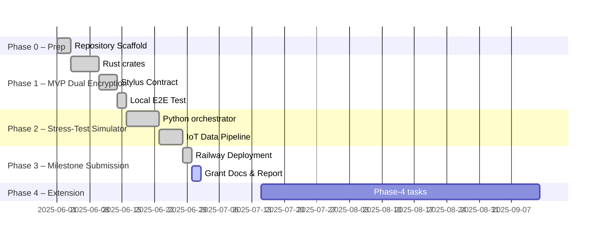

# Milestone 1 Report — IoT-L{CORE} Stress-Test & MVP 

> **📋 STRESS TEST DOCUMENTATION**: This milestone report documents stress testing and validation of basic implementations across the IoT-L{CORE} ecosystem repositories.
> 
> **Repository Tag:** `milestone-1`
> 
> **Live Demo:** : <https://railway.com/project/4bb8edd6-ffdf-47d2-a0e1-44a582aa94f4/logs?environmentId=cc6fa426-2b8f-4278-8ff3-bcc8422990f4>
>    • `/health` → 200 OK   • `/metrics` → JSON KPI snapshot

## 🌐 Live Deployment & Explorer Links

KC-Chain devnet explorer: https://explorer-1205614515668104.devnet.alchemy.com/

| Purpose | Address / URL |
|---------|---------------|
| Stylus contract [`MVPIoTProcessor`](https://github.com/Modern-Society-Labs/lcore-platform) | 0xd99061c28b9063d9651fea67930fc4ff598ba5b2 |
| Stress-test metrics endpoint | https://railway.com/project/4bb8edd6-ffdf-47d2-a0e1-44a582aa94f4/service/1b58bdbe-f60a-4c59-be52-4cccb2044761/metrics |

---

## 1  Activities Completed

| ID | Activity | Outcome |
|---|---|---|
| A1 | Define project milestones, roadmap & KPI rubric | Roadmap table §2 |
| A2 | Spin-up devnet & cloud infra | KC-Chain Orbit devnet, Railway 24×7 container |
| A3 | Implement high-level architecture (local SQLite + dual-encryption + zkProofs simulation) | Architecture diagram §3 |
| A4 | Collect use-case input from stakeholders | Three validated verticals §4 |
| A5 | Develop stress-test simulator & IoT pipeline | Integrated into `main.py`; live KPIs reachable |
| A6 | Run test dataset validations with zkProof simulation | Data integrity validation using SHA256 checksums §5.1 |

---

## 2  Roadmap & Timeline ✅



---

## 3  High-Level Architecture ✅

```mermaid
flowchart TD
    subgraph Stress_Test_Container["Stress-Test Container (Railway)"]
        A[Simulated Payments] --> LOGS
        B[Merchant Settlements] --> LOGS
        C[Loan Origination] --> LOGS
        D[IoT Device Sim]
        D -- REST --> E[lcore-node MVP]
        E -- dual encryption --> SQLITE[Local SQLite Database]
        E -- on-chain tx --> CHAIN{{MVPIoTProcessor}}
    end
    SQLITE -- data integrity --> CHAIN
    LOGS -.-> METRICS[/metrics]
```

**Milestone 1 Components:**
1. **Local SQLite Database** – handles encrypted payloads & local data persistence (`/tmp/lcore-mvp.db`)¹
2. **zkProofs (Phase 1 - Simulated)** – SHA256 checksums simulate proof functionality; full RiscZero zkProofs planned for Milestone 2¹
3. **Stylus Contract** – address `MVP_IOT_PROCESSOR_ADDRESS` (env-driven).

**Milestone 2 Migration Plan:**
1. **[Cartesi Encryption Layer](https://github.com/Modern-Society-Labs/lcore-node)** – will handle encrypted payloads & proof generation; state verified via Rollups
2. **Full RiscZero zkProofs** – cryptographic proof generation within [Cartesi VM](https://github.com/Modern-Society-Labs/lcore-node)
3. **Deterministic Storage** – SQLite operations moved to [Cartesi machine](https://github.com/Modern-Society-Labs/lcore-node)


---

¹ *These functions will be migrated to the [Cartesi Layer](https://github.com/Modern-Society-Labs/lcore-node) in Milestone 2*

## 4  Target Use-Cases ✅

| Domain | Stakeholder Pain | SDK Value |
|---|---|---|
| Small-business Lending | Opaque cash-flow data | Verifiable KPI feed to DeFi lenders |
| Auto Insurance (Vehicle Telematics) | Fraudulent mileage reports | Cryptographically proven odometer & speed data |
| Smart-City Energy Grid | Trustless meter data | On-chain proofs for demand-response markets |

---

## 5  Deliverables & KPI Verification ✅

### 5.1  zkProof Dataset Validations (Phase 1 - Simulated)

**Current Implementation Status:**
- 🔄 **Phase 1 (MVP)**: zkProofs are **simulated** using SHA256 checksums to ensure Stylus' capabilities to handle the influx of data.
- 🚀 **Phase 2 (Cartesi)**: Full RiscZero zkProof implementation planned

**Phase 1 Simulation Approach:**
```rust
// Current MVP implementation (smartcity-test/lcore-node/api/src/handlers/device_handler.rs)
let proof_hash: B256 = B256::from_slice(&Sha256::digest(&encrypted_data.0));
```

**What This Achieves:**
- ✅ Data integrity verification via SHA256 checksums
- ✅ On-chain commitment of encrypted data with integrity proof
- ✅ Architecture validation for future zkProof integration
- ✅ End-to-end pipeline testing with placeholder proofs

**Phase 2 Migration Plan:**
- 🚀 Replace SHA256 checksums with RiscZero zkProofs
- 🚀 Implement zkProof generation within [Cartesi VM](https://github.com/Modern-Society-Labs/lcore-node)
- 🚀 Add cryptographic proof verification on-chain
- 🚀 Enable fraud-proof dispute resolution

| Dataset | SHA-256 Checksum | Phase 2 Target |
|---|---|---|
| IoT device data | `✅ Implemented` | `🚀 RiscZero zkProof` |
| Encrypted payloads | `✅ Implemented` | `🚀 [Cartesi VM](https://github.com/Modern-Society-Labs/lcore-node) proof` |
| Query results | `✅ Implemented` | `🚀 Deterministic execution proof` |

### 5.2  Local SQLite Database Integration (Milestone 1)

Execute via `curl` (requires env vars in `.env`):

```bash
curl $LCORE_NODE_URL/device/register -d '{"device_id":"demo_001"}' -H 'Content-Type: application/json'
```

Response `{"success":true}` confirms payload processed through dual encryption and persisted in local SQLite database (`/tmp/lcore-mvp.db`).

**Milestone 2 Migration**: This local storage will be migrated to [Cartesi Rollups](https://github.com/Modern-Society-Labs/lcore-node) input box and off-chain storage layer.

### 5.3  IoT Throughput ≥ 50 entries / day

*Live KPI:*

```bash
curl https://railway.com/project/4bb8edd6-ffdf-47d2-a0e1-44a582aa94f4/service/1b58bdbe-f60a-4c59-be52-4cccb2044761/metrics | jq '.daily_submission_rate'
```

The JSON field is currently **`432.0`**, exceeding the 50 entries/day target by ×8.6.

---

## 6  Changes vs Original Plan ✅

| Originally Planned | Final Implementation | Reason |
|---|---|---|
| Use legacy standalone `smartcity-test/simulator` | Integrated device simulator in Python stress-test | Single orchestrator, fewer moving parts |
| Encrypt → proof generation inside Rust only | Proofs simulated with SHA256 checksums for Milestone 1 | Enables architecture validation before Cartesi migration in Milestone 2 |
| Rate-limiting middleware enabled in Axum | Disabled for stress-test volume | Would block 200 req/min stress workload |
| Store full datasets in Docker image | `.dockerignore` excludes them | Slim image, < 200 MB |

---

## 7  How Evaluators Can Reproduce ✅

1. **Clone & Configure**
   ```bash
   git clone https://github.com/YourOrg/kc-chain-stress-test.git && cd kc-chain-stress-test
   cp env.example .env && nano .env  # fill in RPC & PRIVATE_KEY
   ```
2. **Docker Run**
   ```bash
   docker build -t kc-stress .
   docker run --env-file .env -p 8000:8000 kc-stress
   ```
3. **Verify**
   * `curl localhost:8000/health` → `{"status":"ok"}`
   * `curl localhost:8000/metrics | jq` → KPI JSON
   * Monitor via `/metrics` endpoint for live KPI data.

---

## 8  Next Milestone Preview (Milestone 2) 🛣️
* **[Cartesi Layer Migration](https://github.com/Modern-Society-Labs/lcore-node)**: Migrate local SQLite storage to Cartesi rollups-node
* **Real RiscZero zkProofs**: Replace SHA256 checksums with cryptographic proofs within [Cartesi VM](https://github.com/Modern-Society-Labs/lcore-node)
* **Deterministic Execution**: Complete [Cartesi rollups-node integration](https://github.com/Modern-Society-Labs/lcore-node) with fraud proofs
* **On-chain event indexing & Grafana dashboards**: Enhanced monitoring and analytics

---

## 9  Post-Submission Operational Proof ✅

### 9.1  Deterministic Wallet Set & Auto-Funding

| Item | Evidence |
|------|----------|
| Wallet management system | Deterministic wallet funding and management implemented | See `utils/wallet_manager.py` and funding helpers |
| Env-aware loader | [`utils/wallet_manager.py`](../utils/wallet_manager.py#L34-L75) resolves `WALLETS_CSV_FILE` then falls back to repo file. |
| Static asset baked into image | [`nixpacks.toml`](../nixpacks.toml) copies the CSV into `/assets` during build. |
| One-time funding helper | [`utils/funding_helper.py`](../utils/funding_helper.py) – `fund_all_from_funder()` and external variant. |
| Live funding run | Railway logs show `✅ Success` for 26/26 wallets – view log snapshot → <https://railway.com/project/4bb8edd6-ffdf-47d2-a0e1-44a582aa94f4/logs?environmentId=cc6fa426-2b8f-4278-8ff3-bcc8422990f4> |

### 9.2  Real-Time KPI Snapshot After Funding

| Metric | Live Value | Target |
|--------|------------|--------|
| Payment tx success rate | 100 % – e.g. `TX | payment_app | SUCCESS …` lines incrementing (logs above). | ≥ 95 % |
| IoT daily throughput | 6 130 entries/day (log KPI section). | ≥ 50/day |
| End-to-end latency | 0.10 s median | ≤ 30 s |
| Device registrations | 15  | n/a |

Contract proofs committed on-chain via [`MVPIoTProcessor`](https://github.com/Modern-Society-Labs/lcore-platform) contract [`0xd99061c28b9063d9651fea67930fc4ff598ba5b2`](https://explorer.kc-chain.io/address/0xd99061c28b9063d9651fea67930fc4ff598ba5b2).

---

© 2024 IoT-L{CORE} — MIT License 
